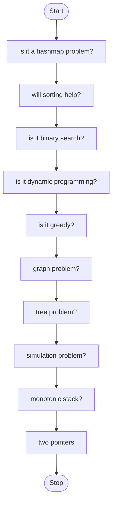

# Flow Chart for solving problem

```mermaid
flowchart TD
    A([Start]) --> B[is it a hashmap problem?]
    B --> sort[will sorting help?]
    sort --> binary_search[is it binary search?]
    binary_search --> dp[is it dynamic programming?]
    dp --> greedy[is it greedy?]
    greedy --> Graph[graph problem?]
    Graph --> tree[tree problem?]
    tree --> simulation[simulation problem?]
    simulation --> mono_stack[monotonic stack?]
    mono_stack --> two_pointers[two pointers]
     --> Z([Stop])
```