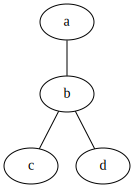
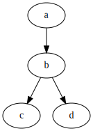
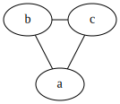
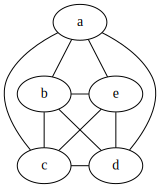
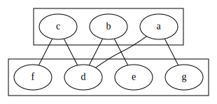
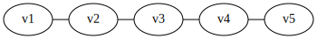
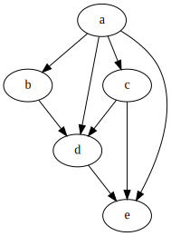

## General Classification

### Undirected graph

In undirected graph the edge for a node $a$ to $b$ is considered same
as node from $b$ to $a$.

??? Example
    

$$
G = (V, E)
$$

- vertex $V$ - $\{a, b, c, d, e\}$
- edges $E$ - $\{(a, b), (a, c), (b, d), (d, e)\}$

Here in $(a, b)$ - $a$, $b$ are the endpoints of the edge.

- **Order of graph** = no of vertices $|V|$
- **Size of graph** = no of edges $|E|$ or for computational complexity $|E|+|V|$

### Directed Graph

Also called *digraph* or *directed simple graph*.

??? Example
    

$G = (V, E)$

- $V$ is set of vertices
- $E$ is subset of $\{(x, y) | (x, y) \in V \times V \text{and } x \ne y\}$

### Multigraph

Generalization that allows multiple edges to have the same pair of endpoints.

### Directed multigraph

$G = (V, E, \phi)$

- $V$ - set of vertices
- $E$ - set of edges
- $\phi$ - an incidence function mapping every edge to an ordered pair of vertices

### Directed multigraph permitting loops or directed simple graph permitting loops

- $(x,x)$ can be now a edge, for example as those present in finite state automata state transitions diagrams.

### Weighted graph

In this graph there is a weight assigned to each edge.
For example in case of a map the distance between two locations.
We can add to any type of graph and it will be considered weighted graph.
So we can have weighted directed graph, weighted undirected graph and so on.

## Types of Graph

### Oriented Graph

One definition of an oriented graph is that it is a directed graph
in which at most one of $(x, y)$ and $(y, x)$ may be edges of the graph.

### Regular graph

A regular graph is a graph in which each vertex has the same number of neighbors,
i.e., every vertex has the same degree.

### Complete graph

A complete graph is a graph in which each pair of vertices is joined by an edge. A
complete graph contains all possible edges.

Total no of edges = $n (n-1) / 2$

### Finite graph

A finite graph is a graph in which the vertex set and the edge set are finite sets.
Otherwise, it is called an infinite graph.

### Connected graph

In an `undirected graph`, an unordered pair of vertices $(x, y)$ is called `connected`
if a path leads from $x$ to $y$. Otherwise, the unordered pair is called `disconnected`.

A **connected graph is an undirected graph** in which every unordered pair of vertices
in the graph is connected. Otherwise, it is called a disconnected graph.

In a directed graph, an ordered pair of vertices $(x, y)$ is called

- strongly connected if a directed path leads from $x$ to $y$
- weakly connected if an undirected path leads from $x$ to $y$
  after replacing all of its directed edges with undirected edges
- otherwise, the ordered pair is called disconnected

A strongly connected graph is a directed graph in which every ordered pair of vertices
in the graph is strongly connected.

Otherwise, it is called a weakly connected graph if every ordered pair of vertices in
the graph is weakly connected. Otherwise it is called a disconnected graph.

A k-vertex-connected graph or k-edge-connected graph is a graph in which no set of $k - 1$
vertices (respectively, edges) exists that, when removed, disconnects the graph.
A k-vertex-connected graph is often called simply a k-connected graph.

### Bipartite graph

A bipartite graph is a simple graph in which the vertex set can be partitioned into
two sets, $W$ and $X$, so that no two vertices in $W$ share a common edge and no two vertices
in $X$ share a common edge. Alternatively, it is a graph with a chromatic number of 2.

### Path Graph

A **path graph** or **linear graph** of order $n \ge 2$ is a graph in which the vertices can
be listed in an order $v_1, v_2, \cdots, v_n$ such that the edges are the $\{v_i, v_{i+1}\}$ where
$i = 1, 2, \cdots, n-1$.

Path graphs can be characterized as connected graphs in which the degree of all but two vertices
is 2 and the degree of the two remaining vertices is 1.
If a path graph occurs as a subgraph of another graph, it is a path in that graph.

### Planar graph

A planar graph is a graph whose vertices and edges can be drawn in a plane
such that no two of the edges intersect.

### Cycle graph

A cycle graph or circular graph of order $n \ge 3$ is a graph in which the vertices
can be listed in an order $v_1, v_2, \cdots, v_n$ such that the edges are the
$\{v_i, v_{i+1}\}$ where $i = 1, 2, \cdots, n - 1$, plus the edge $\{v_n, v_1\}$.
Cycle graphs can be characterized as connected graphs in which the degree
of all vertices is 2. If a cycle graph occurs as a subgraph of another graph,
it is a cycle or circuit in that graph.

### Tree

A tree is an undirected graph in which any two vertices are connected by exactly one
path, or equivalently a connected acyclic undirected graph.

A forest is an undirected graph in which any two vertices are connected by at most one
path, or equivalently an acyclic undirected graph, or equivalently a disjoint union of
trees.

### Polytree

A polytree (or directed tree or oriented tree or singly connected network) is a
directed acyclic graph (DAG) whose underlying undirected graph is a tree.

A polyforest (or directed forest or oriented forest) is a directed acyclic graph
whose underlying undirected graph is a forest.

### Directed acyclic graph (DAG)

DAC is a directed graph with no directed cycles. That is, it consists of vertices
and edges (also called arcs), with each edge directed from one vertex to another,
such that following those directions will never form a closed loop.

